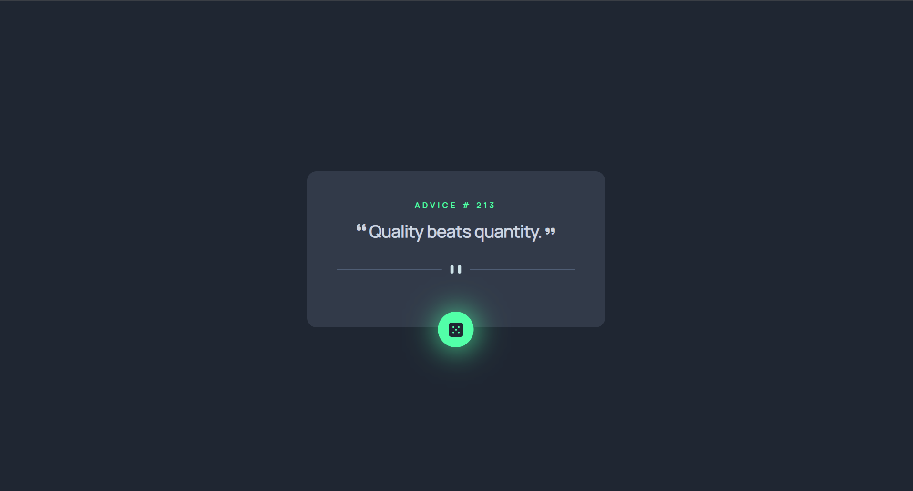

# Frontend Mentor - Advice generator app solution

This is a solution to the [Advice generator app challenge on Frontend Mentor](https://www.frontendmentor.io/challenges/advice-generator-app-QdUG-13db). Frontend Mentor challenges help you improve your coding skills by building realistic projects.

## Table of contents

- [Overview](#overview)
  - [The challenge](#the-challenge)
  - [Screenshot](#screenshot)
  - [Links](#links)
- [My process](#my-process)
  - [Built with](#built-with)
  - [What I learned](#what-i-learned)
- [Author](#author)

## Overview

### The challenge

Users should be able to:

- View the optimal layout for the app depending on their device's screen size
- See hover states for all interactive elements on the page
- Generate a new piece of advice by clicking the dice icon

### Screenshot

### Links

- Solution URL: [https://github.com/Poonamkothawade25/fem-advice-generator-app-api]
- Live Site URL: [https://poonamkothawade25.github.io/fem-advice-generator-app-api/]

## My process

### Built with

- Semantic HTML5 markup
- Flexbox
- CSS Grid
- Desktop-first workflow
- CSS filter property
- Javascript fetch method to integrate API

### What I learned

- How to integrate APIs using javscript fetch method
- How to give glow effect using CSS filter dropshadow propery.

## Author

- Frontend Mentor - [https://www.frontendmentor.io/profile/Poonamkothawade25]
